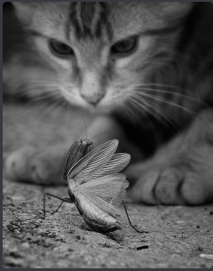

# Random Cat Image

## Code

```javascript
// This snippet uses some-random-cat version 2.0

const somethingRandom = require('some-random-cat').Random
somethingRandom.getCat()
.then(res => {
    console.log(res)
    return
}) // Get the result
.catch(e => {
    console.error(e)
    return
}) // Catch the error
```

## Output



